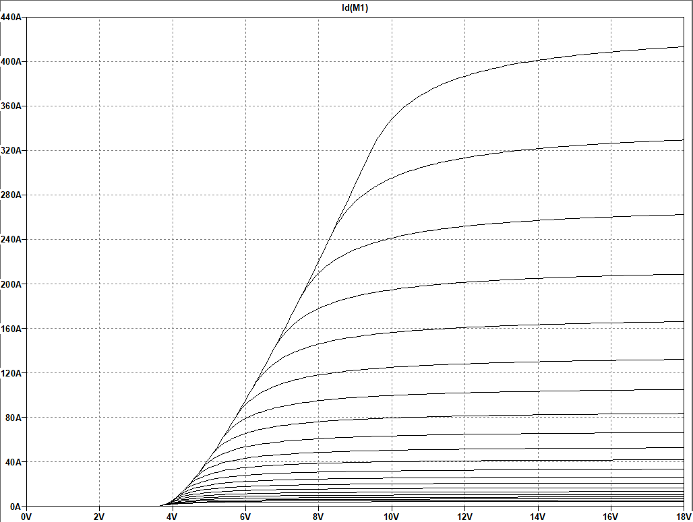
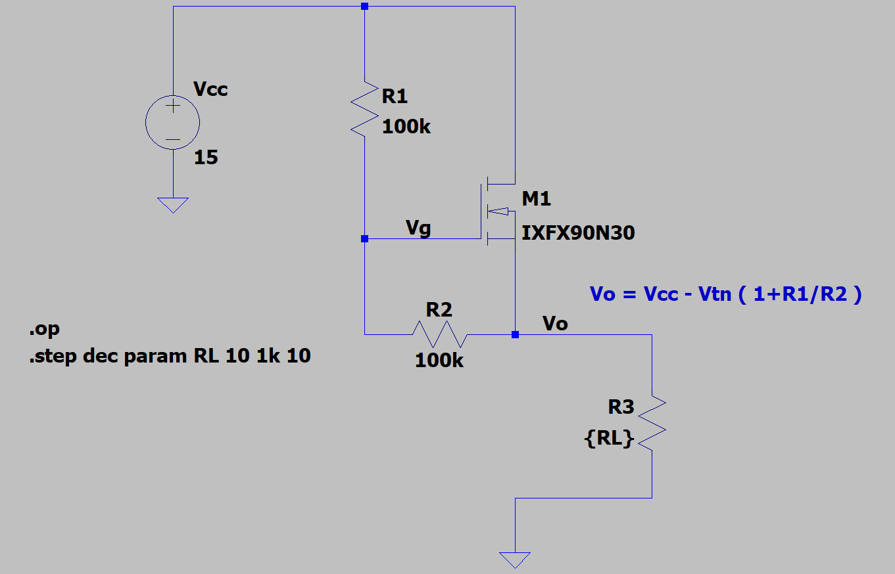

# Linear Voltage regulators with mosfet

---

 
 

 For a fixed value of Vds, Id is plotted against variations of Vgs. It can be seen that conduction happens after Vtn (threshold voltage).
 Once Vtn is reached, small variations on Vgs can make big variations on Id and Vds, similar to what happens with a diode and bjt transistor.
 This can be helpfull for voltage regulation. This can be seen in nMos_alone_regulator.asc, and basic.asc.

 
$I_d = 0$  If:  $V_{gs} < V_{TN}$ (no conduction)
 
$I_d = K_n [2 V_{ds-sat} V_{ds} - V_{ds}^2 ]$  If:  $V_{gs} > V_{TN}$ and $V_{ds} < V_{ds-sat}$ (Triode Region)

$I_d = K_n V_{ds-sat}^2$  If:  $V_{gs} > V_{TN}$ and  $V_{ds} \geq V_{ds-sat}$(Saturation Region)

$V_{ds-sat} = V_{gs} - V_{TN}$

 

---

## Motivation

Analog and digital IC usually have no more than 30v to 40v as maxium input voltage. IC supporting 60v input are rare to my personal expirience. 
In the [Boost converter application](https://github.com/raulest50/AnalogDesign/tree/main/BoostConverter), the solar panels delivered 60v. To allow the control circuit to operate, it was powered with the batteries instead of the solar panels. The 60v input powered the Boost topology. To Inprove efficiency it is convenient to have a circuit to regulate the 60v input to more suitable voltage for IC used in control circuit. That nesessity inspire the simulation nMos_Ze_regulator_v1.asc which presents an alternative to this problem using Zener diode and Mosfet. This simulations led me to explore the mosfet capabilities as a current sink, voltage regulator, and current limiter among others.

